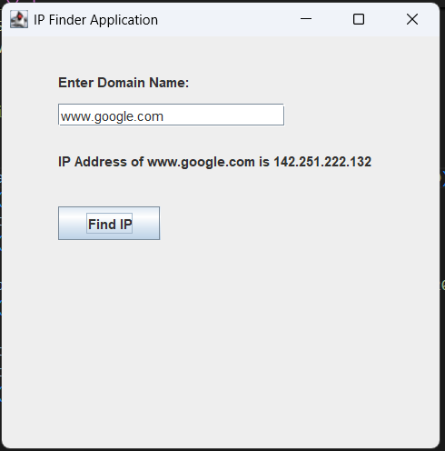

# Welcome!!!

# Swing-Ip-Finder

A simple Java Swing application that allows users to resolve domain names into their corresponding IP addresses.

## Features

* **Domain Name Resolution**: Users can enter any domain name (e.g., `www.google.com`), and the application will resolve it to its corresponding IP address.
* **Error Handling**: If an invalid domain name is entered or an error occurs during the lookup process, the application will display a helpful error message.

## Technologies Used

* **Java 8+**: Core language for building the application.
* **Swing**: A Java GUI toolkit used for creating the graphical user interface (UI).
* **Java Networking API**: Used to resolve domain names into IP addresses using the `InetAddress.getByName()` method.

## Screenshot

Here's a screenshot of the application in action:

